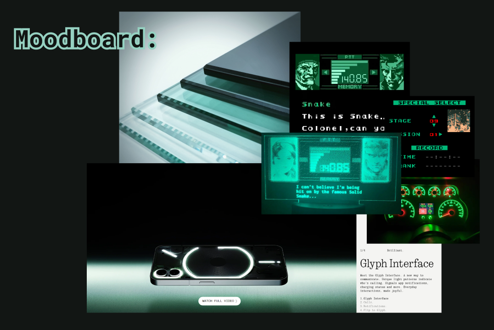

# Portfolio
👋❗ My name is Saadaf. I hope you're well. Welcome to my portfolio.

# Identity
The website's design is inspired by the _Nothing_ phone's brand identity, Metal Gear Solid user interfaces, 90's electroluminescent gauge clusters, and tempered glass. Refer to the moodboard below. 
  
It all really kicked off when I saw the image of the _Nothing_ phone, and how its hovering over a backdrop with colours that reminded me of tempered glass. I then remembered how much I love the green of tempered glass. Overall, I feel whoever took the picture of the _Nothing_ phone may have also been inspired by the colours of glass the same way I did. There's a certain demeanor about that image and the identity of the brand; **stealthy**, **dystopian**, **intense**. I could use the same words to descibe the user experience that _Metal Gear Solid_ successfully executes. In addition to **dystopian** - with inspiration from retro electroluminescent gauge clusters, the identity simultaneously attempts to deliver a feeling of **nostalgia** as well.

 

# Notes
This project was originally an attempt to clone my first portfolio website, but now it's my main. There is more modularity to the classes and uses much less code.

# Why?
Why are you building out the same project again? Well, there's two reasons. The primary one is that my first website was built with Desktop-first approach, but I'd like to build it mobile-first. Tailwind is designed to make mobile-first development easy. Second is just because I've grown a liking towards tailwind. I think it's pretty cool

# Experiences
- Responsive Web Design with a mobile-first approach
- Analyze and deconstruct a website to understand its design and functionality; reverse-engineering my own website
- Understanding of how different technologies work together improving problem-solving skills
- Challenges of cloning a website with a mobile-first approach that was originally built with a desktop-first approach
  - E.g., Approach
    - Examine #profile-description from mobile query POV
    - From mobile query, some properties are not overridden and therefore mobile query has some desktop query props
    - After translating default (props outside of any query), go back and revise each query from smallest to largest and adjust or unset props
  - E.g., Thoughts
    - If you override a style in a media query, that style will remain unless overridden by a larger query.
    - That said, this seems to be a complication that only occurs if a project was built desktop first.
